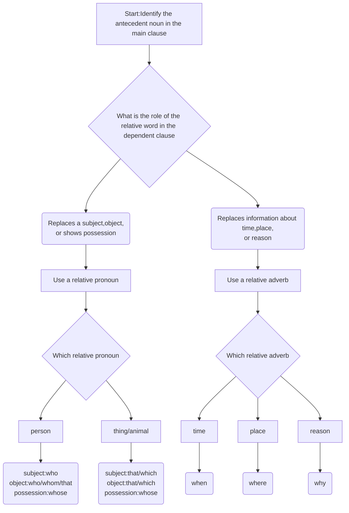

## Definition

A type of dependent clause that provides extra information 
about a noun in the main clause.The noun that be modified
is called **antecedent**.
## Function

They serve as an adjective to modify the noun. That's why 
they are also called **adjective clause**.
# Features

Usually, they come after the noun they modify. Basic relative
clauses begin with **relative words** which include **relative
pronouns** and **relative adverbs**.

## Leading words
#### **1. Relative Pronouns**

| Pronoun   | Used For                                                     | Example (Restrictive)                       | Example (Non-Restrictive)                           |
| --------- | ------------------------------------------------------------ | ------------------------------------------- | --------------------------------------------------- |
| **Who**   | People (subject)                                             | The woman **who lives here** is a doctor.   | My sister, **who lives in Paris**, is visiting.     |
| **Whom**  | People (object) _formal_                                     | The man **whom I met** was friendly.        | The director, **whom we admire**, gave a speech.    |
| **Whose** | People/Things (possession)                                   | That's the student **whose book I found**.  | My boss, **whose opinion I value**, agreed.         |
| **Which** | Things & Animals                                             | The book **which is on the table** is mine. | This laptop, **which I bought last year**, is fast. |
| **That**  | People, Things & Animals **(Only in _Restrictive_ clauses)** | The movie **that we saw** was great.        | ~~My car, that is red, is fast.~~ (Incorrect)       |

**Key Point:** **"That"** cannot be used to introduce a _non-restrictive_ clause (the one with commas). Use **"which"** or **"who"** for those.
#### **2. Relative Adverbs**

These replace a preposition + relative pronoun (like _in which_, _on which_, _for which_) and refer to a time, place, or reason.

|Adverb|Refers To|Replaces|Example|
|---|---|---|---|
|**When**|Time|in/on/at which|I remember the day **when we met**. (the day **on which** we met)|
|**Where**|Place|in/at which|This is the house **where I grew up**. (the house **in which** I grew up)|
|**Why**|Reason|for which|Tell me the reason **why you are late**. (the reason **for which** you are late)|

**Usage Note:** Relative adverbs are almost always used in _restrictive_ clauses. They are less common in non-restrictive clauses, but possible (e.g., _The concert, **when it finally started**, was amazing._).

## Hints for choosing relative word

**We choose the relative word based on the grammatical role it plays in the dependent clause.

## Main types
### 1.Restrictive relative clause

Provides **essential information** about the noun.

### 2.Non-restrictive relative clause

Provides **non-essential information** about the noun.

### 3.Reduced relative clauses

**Reduce**: Remove the relative **pronoun** and **linking verb**.

**Reduce if:** 
- 1.The relative clause uses **a relative pronoun+progressive
  verb/passive form/adjective/prepositional phrase** 
- 2.The relative pronoun functions as the **object** of the clause.

## Examples
- 1.This marker,which is bought by my company,is red.
  
- 2.The computer that he bought online is fast.
  
- 3.The computer that he bought at a second-hand shop is slow.
  
- 4.The guy (who is) talking to the teacher is my roommate.
  
- 5.This is the book (that) you recomended.
  
- 6.Which of these drinks (that are on the table) is yours?
  
- 7.Did everyone who took the trip get sick?
  
- 8.This is the place (where) we first met.
  
- 9.Do you remember the time (when) we met on a family trip to Europe?

## Tips of identifying relative clause

- 1. **punctuation**: Restrictive relative clauses sometimes
  have **commas** around them.
  
- 2.A **phrase** that begins with a relative pronoun.
  
- 3.A phrase that follows a noun and gives **extra information**. 
  
- 4.If we remove the relative clauses the whole sentence is
  still grammatically correct.
  
